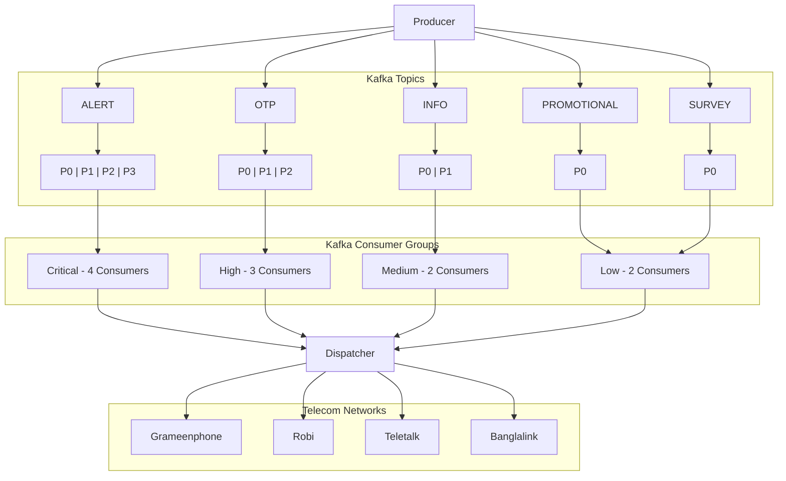

# sms-gateway

```mermaid
flowchart TB
    A["Producer"]
    subgraph Topics["Kafka Topics"]
        direction TB

        T1["ALERT"]
        T2["OTP"]
        T3["INFO"]
        T4["PROMOTIONAL"]
        T5["SURVEY"]

        P1["P0 | P1 | P2 | P3"]
        P2["P0 | P1 | P2"]
        P3["P0 | P1"]
        P4["P0"]
        P5["P0"]

        T1 --> P1
        T2 --> P2
        T3 --> P3
        T4 --> P4
        T5 --> P5
    end

    subgraph Consumers["Kafka Consumer Groups"]
        G1["Critical - 4 Consumers"]
        G2["High - 3 Consumers"]
        G3["Medium - 2 Consumers"]
        G4["Low - 2 Consumers"]
    end

    S["Dispatcher"]

    subgraph Telecom["Telecom Networks"]
        GP["Grameenphone"]
        RB["Robi"]
        TT["Teletalk"]
        BL["Banglalink"]
    end

    A --> T1 & T2 & T3 & T4 & T5

    P1 --> G1
    P2 --> G2
    P3 --> G3
    P4 --> G4
    P5 --> G4

    G1 & G2 & G3 & G4 --> S

    S --> GP & RB & TT & BL
```
